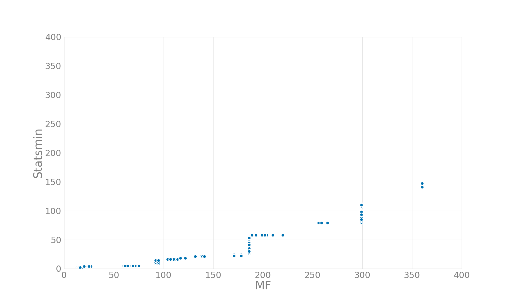
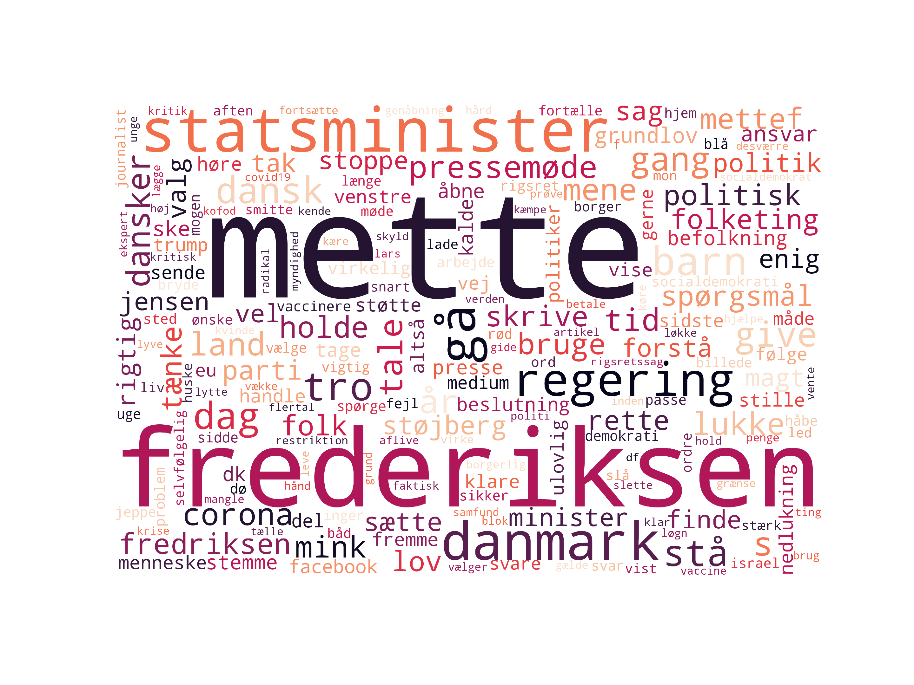

# HOPE: Mentions of Mette Frederiksen in the Danish Twitter
This repository contains an overview of the discourse on the Danish Twitter in relation to the Danish prime minister Mette Frederiksen.

Data was collected with the following keywords:
- 'mettef', 'mettefrederiksen', 'mettefredriksen', 
- 'mette frederiksen', 'mette fredriksen',

A separate dataset was collected with the keyword:
- '@statsmin'

The search checks for which keywords and keyword combinations are mentioned in a tweet. Overall, there are **26 461** matching tweets, with an average of **95.5** tweets per day.

## Date range
1.01.2020 until 10.06.2021

## Preprocessing
Retweets were discarded, and quote tweets were removed. The way of removal was via checking whether the 50 first characters overlapped between the tweets in the dataset (user mentions in the beginning of tweets were ignored). This resulted in the removal of 2236 duplicates.

## Time series analysis

The above figure shows the total mentions of Mette Frederiksen together with the mentions of @Statsmin. Normally, there are more tweets mentioning Mette Frederiksen, but the baseline frequency of tweets per day is low (less than 300 tweets per day). The mentions of @statsmin and Mette Frederiksen seem to correlate. The correlation is visualized in the below plot.

The correlation between the mentions is leaning towards Mette Frederiksen mentions which means that @Statsmin has a lower number of mentions for every Mette Frederiksen mention, but they do have a tendency to co-occur in the data.

## Frequent hashtags
A hashtag analysis was conducted to see if there might be a trending hashtag popping up in the dataset.

These are the 30 most popular hashtags used in the dataset. The most popular hashtags are popular hashtags related to Covid-19 - #dkpol, #covid19dk, #dkmedier. Thereafter hashtags like #mettefrederiksen together with mink-related hashtags show up.

## Sentiment analysis
The compound semantic scores were calculated with the Danish Vader. They were centered and smoothed.

There is not enough data to have reliably strong signal in the sentiment scores. Comparing Mette Frederiksen to @statsmin shows that they both vary a lot and center around 0.

The above plot visualizes the sentiment of Mette Frederiksen's mentions together with the mentions count. The sentiment scores vary a lot and the average is mostly centered around 0. The sentiment around November 2020 is more certainly negative as there are most mentions of Mette Frederiksen there.

## Word frequency
For the following analysis, all tweets were tokenized and lemmatized, stop words were removed.

Two of the most frequent words against the two most popular hashtags.

## Bigram network analysis
A network-bigram analysis was conducted on the data to investigate which words co-occur. This enables the visualization of bi- and trigrams which the previous word frequency analysis neglects.

There are smaller clusters of the names of some of the other politicians. The larger cluster of Mette Frederiksen includes topics related to the press talks, state, Denmark, governing.