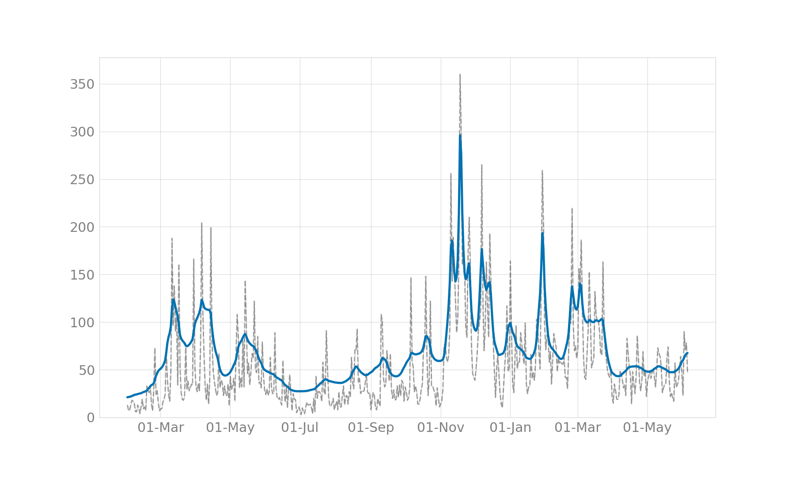
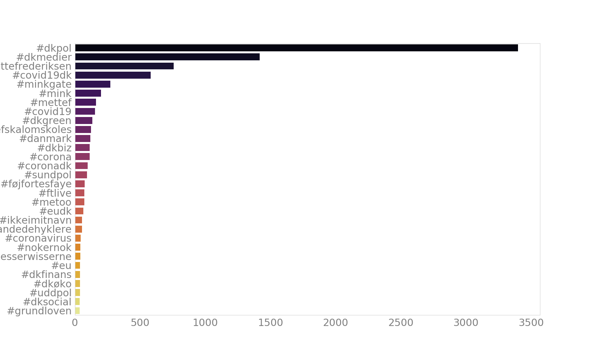
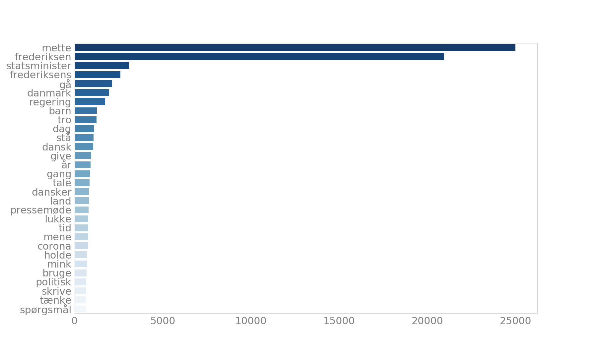
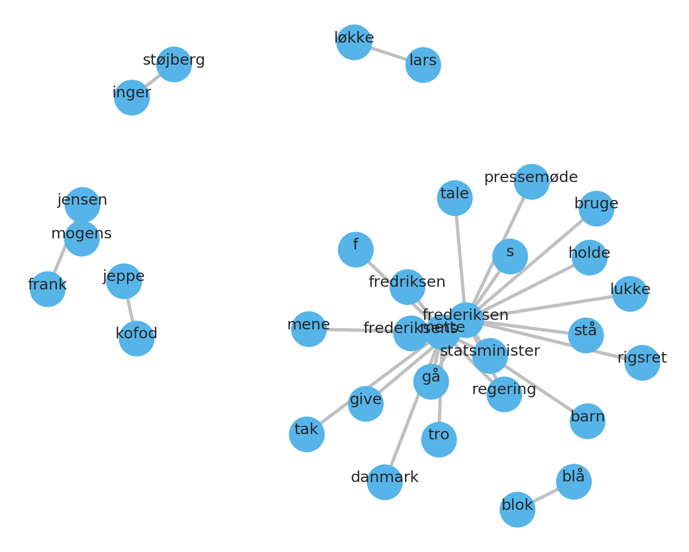

# HOPE: Mentions of Mette Frederiksen in the Danish Twitter. Press meetings
This repository contains an overview of the discourse on the Danish Twitter in relation to the Danish prime minister Mette Frederiksen.

Data was collected with the following keywords:
- 'mettef', 'mettefrederiksen', 'mettefredriksen', 
- '#mettef', '#mettefrederiksen', '#mettefredriksen',
- 'mette frederiksen', 'mette fredriksen',
- '@statsmin'

The search checks for which keywords and keyword combinations are mentioned in a tweet. Overall, there are **28 393** matching tweets, with an average of **144.3** tweets per day.

## Date range
1.12.2020 until 22.01.2021

## Preprocessing
Retweets were discarded, and quote tweets were removed. The way of removal was via checking whether the 50 first characters overlapped between the tweets in the dataset (user mentions in the beginning of tweets were ignored). This resulted in the removal of 2236 duplicates.

## Time series analysis

The above figure shows the total mentions of Mette Frederiksen together with the mentions of @Statsmin. They seem to somewhat correlate. The correlation is visualized in the below plot.

The correlation between the mentions is leaning towards Mette Frederiksen mentions which means that @Statsmin has a higher number of mentions for every Mette Frederiksen mention, but they do have a tendency to co-occur in the data.

## Frequent hashtags
A hashtag analysis was conducted to see if there might be a trending hashtag popping up in the dataset.

These are the 30 most popular hashtags used in the dataset. The most popular hashtags are popular hashtags related to Covid-19 - #dkpol, #covid19dk, #dkmedier. Thereafter hashtags like #mettefrederiksen together with mink-related hashtags show up.

## Sentiment analysis
The compound semantic scores were calculated with the Danish Vader.

Taking the monthly averages of compound sentiment shows that the average is always slightly positive, and the lowest it gets on average is in December 2020.

## Word frequency
For the following analysis, all tweets were tokenized and lemmatized, stop words were removed.

Two of the most frequent words against the two most popular hashtags.

## Bigram network analysis
A network-bigram analysis was conducted on the data to investigate which words co-occur. This enables the visualization of bi- and trigrams which the previous word frequency analysis neglects.

